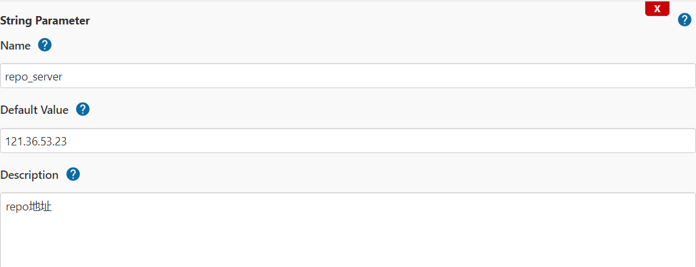
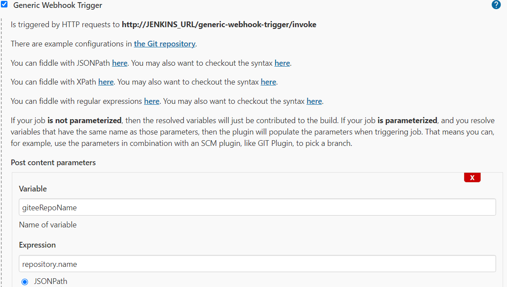
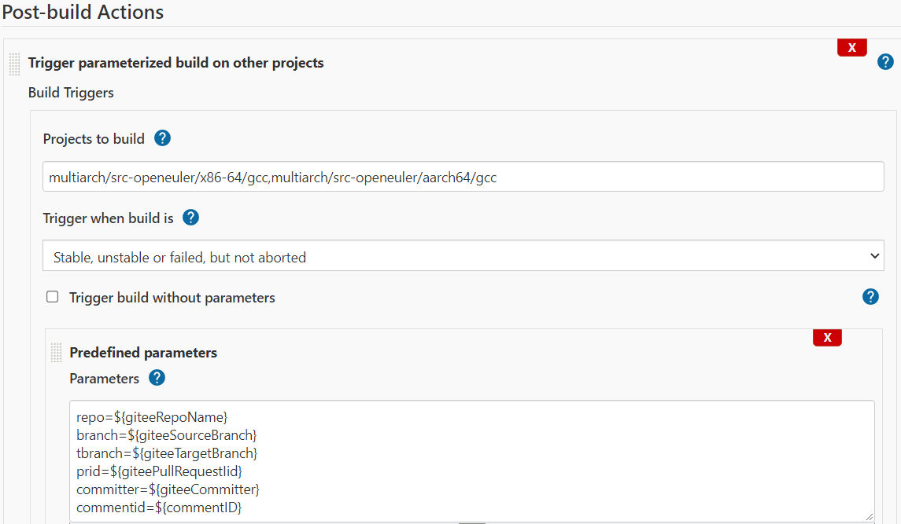
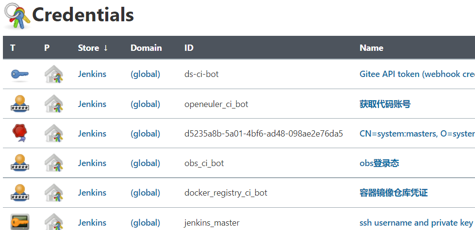

# 一、trigger阶段参数列表

| 参数名               | 默认值                           | 描述                                           | 来源            |
| -------------------- | -------------------------------- | ---------------------------------------------- | --------------- |
| repo_server          | 121.36.53.23                     | repo地址，用来存储工程之间共享的文件服务器     | 自定义          |
| giteeRepoName        | repository.name                  | gitee仓库名                                    | Webhook         |
| giteePullRequestIid  | pull_request.number              | prid                                           | Webhook         |
| giteeSourceBranch    | pull_request.head.ref            | PR源代码分支                                   | Webhook         |
| giteeTargetBranch    | pull_request.base.ref            | PR目标代码分支                                 | Webhook         |
| giteeSourceNamespace | pull_request.head.repo.namespace | PR源命名空间（openeuler/src-openeuler/用户名） | Webhook         |
| giteeTargetNamespace | pull_request.base.repo.namespace | PR目标命名空间（openeuler/src-openeuler/用户名 | Webhook         |
| giteeCommitter       | pull_request.user.login          | 提交人                                         | Webhook         |
| comment              | comment.body                     | 评论内容                                       | Webhook         |
| commentID            | comment.id                       | 评论id                                         | Webhook         |
| jobTriggerTime       | comment.updated_at               | 门禁触发时间                                   | Webhook         |
| prCreateTime         | pull_request.created_at          | PR创建时间                                     | Webhook         |
| triggerLink          | comment.html_url                 | 触发门禁的评论url                              | Webhook         |
| jenkins_user         | jenkins_api_token                | jenkins api的用户名和token                     | jenkins凭证设置 |
| GiteeToken           | openeuler-ci-bot                 | openeuler-ci-bot 评论gitee api token           | jenkins凭证设置 |
| SaveBuildRPM2Repo    | jenkins凭证设置处获取            | sshkey（将打包结果保存到repo的ssh key）        | jenkins凭证设置 |
| GiteeUserPassword    | openeuler_ci_bot                 | 获取代码账号                                   | jenkins凭证设置 |

# 二、trigger阶段配置（以gcc为例）

https://openeulerjenkins.osinfra.cn/job/multiarch/job/src-openeuler/job/trigger/job/gcc/configure

### 参数配置

### 节点配置

选择对应的节点，即可构建对应docker镜像，里面包含一些包的安装和配置文件等。

### 通过webhook设置变量

### Optional filter

可以根据里面配置的正则表达式过滤匹配评论内容，如果匹配到则触发门禁，本例中是如果评论中包含Hi和/retest则启动触发。

### 构建主流程代码配置

此处为构建的主要流程，当前代码路径在https://gitee.com/openeuler/openeuler-jenkins/blob/master/src/lib/trigger.sh，该代码在门禁docker创建上会自动部署。

其中如果需要自己调试的话，可以放开下面注释内容，把代码换成自己要验证的代码路径

### 注入环境变量

会将门禁的检查结果输出acfile文件中，在后面的comment工程中会用到。

格式为ACL=[{"name":"check_spec", "result":0}]

### 构建后操作

**Projects to build：**trigger工程完成后会自动启动此处配置的工程，一般为x86和aarch64两个架构的build工程。如果只需要某个仓库只支持一个架构构建，此处只填写支持架构的工程即可，另外需要在https://gitee.com/openeuler/openeuler-jenkins/blob/master/src/jobs/soe_exclusive_config.yaml里的arch_config把这个包加上。

**Trigger when build is：**Stable,unstable or failed,but not aborted

是指该工程上游工程成功（稳定），不稳定或者失败，但没有中止的情况下都会触发构建

不稳定指在项目构建过程中出现异常，比如磁盘空间不够的异常等。

**Predefined parameters：** 预定义参数，参数可以传递到该工程

### 后连接操作

**Trigger when build is：**Complete (always trigger) ，只要上游工程完成就会触发该工程。

此处配置build完成后需要启动的工程，comment工程中会汇总前面trigger和build中的结果，输出展示到评论中。

# 三、凭证管理

存储在Jenkins中的credentials可以被使用，适用于Jenkins的任何地方 (即全局 credentials),

### 查看当前凭证

https://openeulerjenkins.osinfra.cn/credentials/

### 添加新凭证

https://openeulerjenkins.osinfra.cn/credentials/store/system/domain/_/newCredentials

**Jenkins可以存储以下类型的credentials:**

Secret text - API token之类的token (如GitHub个人访问token)

Username and password - 可以为独立的字段，也可以为冒号分隔的字符串：username:password(更多信息请参照 处理 credentials)

Secret file - 保存在文件中的加密内容

SSH Username with private key - SSH 公钥/私钥对

Certificate - a PKCS#12 证书文件 和可选密码

**ID：**在 ID 字段中，必须指定一个有意义的Credential ID，注意: 该字段是可选的。 如果没有指定值, Jenkins 则Jenkins会分配一个全局唯一ID（GUID）值。

