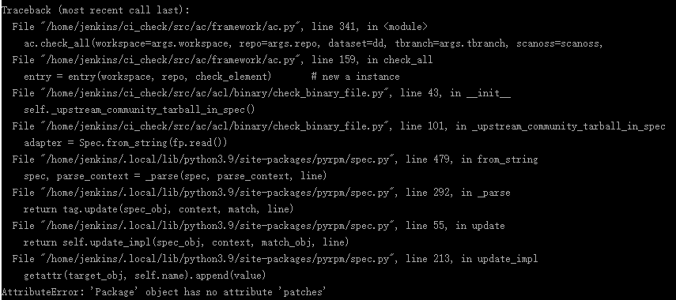
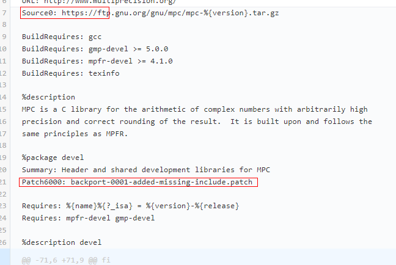
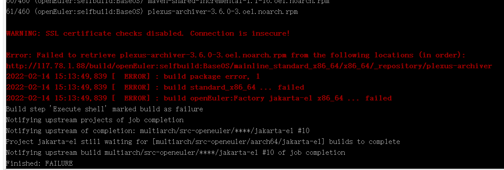
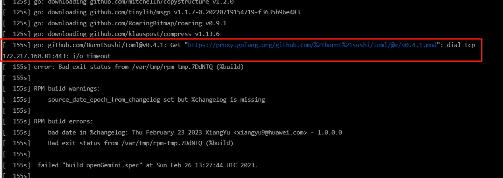

# 门禁问题排查手册

## 1. 门禁流程简介

门禁功能指导手册：https://www.openeuler.org/zh/blog/zhengyaohui/2022-03-21-ci_guild.html

## 2. 沟通地图

| 类型                  | 接口人                                                       |
| --------------------- | ------------------------------------------------------------ |
| 基础设施              | 曹志 george.cao@huawei.com、赵春江 haochunjiang1@h-partners.com、刘奇 liuqi145@h-partners.com |
| obs                   | 董杰 dongjie34@h-partners.com、夏森林 xiasenlin1@huawei.com、王冲 wangchong56@h-partners.com |
| 门禁                  | 王欢 wanghuan158@h-partners.com、程少巍 chenshaowei3@h-partners.com、李海炜 lihaiwei8@huawei.com |
| check_package_license | 陈一雄 chenyixiong3@huawei.com                               |
| check_consistency     | 邱堂珂 qiutangke1@h-partners.com                             |
| compare_package       | 杨裕龙 yangyulong19@h-partners.com                           |

## 3. 门禁常见问题定位

### 3.1 pr触发没显示结果

#### 3.1.1 门禁触发没有任何反应，retest也没有反应

**报错信息：**

PR中没有门禁的任何信息，也没有ci_processing标签

**定位解决：**

确认该包是否是新增的包，如果是新增的包，需要在门禁中查找是否存在该仓的门禁工程，可点击[https://openeulerjenkins.osinfra.cn/job/multiarch/job/src-openeuler/job/trigger/job/{包名称}](https://openeulerjenkins.osinfra.cn/job/multiarch/job/src-openeuler/job/trigger/job/{包名称})查询，如果没有该仓的门禁工程，请联系门禁接口人处理。

#### 3.1.2 门禁一直在ci_processing状态

**报错信息：**

PR中打了ci_processing标签，但是长时间没有门禁结果的回显信息

**定位解决：**

如果pr中已经打了ci_processing标签，说明门禁工程正在运行中，可以根据[附件2：门禁入口链接](#jump2)分别进入trigger、x86-64、aarch64、comment工程中查看工程是否正在运行：

a. 进度条在不停刷新，但是进度条为蓝色，如下图，表示门禁正在运行中，耐心等待即可；

b. 进度条在执行，但是进度条变红，如下图，说明执行时间太长，可能出现卡死情况，请联系门禁接口人处理；

c. 没有分配到资源，如下图提示，请耐心等待，长时间还没有分配到资源的话，请联系**基础设施接口人**处理；

d. 出现如下图提示，表示当前仓库已经有pr正在构建，请等待执行（同一仓库的门禁是串行的，非同一仓库的门禁任务可以并行）；

e. 出现如下图提示，表示当前节点可能在重启，如果长时间保持这种状态，请联系**基础设施接口人**处理；

#### 3.1.3 门禁任务执行完成，但结果不回显

**报错信息：**

PR中打了ci_processing标签，并且trigger、x86-64、aarch64、comment工程都已经执行完成，但是pr中没有显示门禁的构建结果。

**定位解决：**

可能出现comment工程中抛异常，导致上报失败，如下图所示，这种情况请联系门禁接口人。

### 3.2 静态检查失败问题

#### 3.2.1 git fetch失败

**报错信息：**

git fetch failed, 128

**定位解决：**

该pr代码有冲突未解决，请解决该pr的代码冲突后重试。

#### 3.2.2 SPEC文件编写不规范

##### 3.2.2.1 版本号没有更新

**报错信息：**

**current version: 5.15.0-r3, last version: 5.15.0-r3**

**定位解决：**

上述错误中current version指的是本次提交的版本号，last version为当前代码库中的版本号，每次pr提交spec文件中的version号或者release号需要更新。

***要求：版本号不变时，release号必须递增；版本号变化时，release必须置为1；补丁在编译时必须全部应用；changelog格式正确***

##### 3.2.2.2 Patch字段位置不正确

**报错信息：**

**AttributeError: 'Package' object has no attribute 'patches'**

**定位解决：**

Spec文件中的patch字段位置错误，写到%package devel下，不符合spec编写规范，应该写到Source下，问题如下：

#### 3.2.3 门禁代码报分支问题

##### 3.2.3.1 分支停止维护

**报错信息：**

branch "openEuler-20.03-LTS" is no longer maintained!

**定位解决：**

对应分支已停止维护，门禁也不再维护对应问题。

***当前停止维护的分支：*** openeuler-20.03-lts，openeuler-20.03-lts-sp2， openeuler-20.03-lts-next， 
                                  openeuler-21.03，openeuler-21.09

***当前禁止升级版本的LTS分支：*** openeuler-20.03-lts-sp1，openeuler-20.03-lts-sp3，openeuler-22.03-lts

##### 3.2.3.2 门禁不支持该分支，缺少分支映射关系

**报错信息：**

branch "openEuler-22.03-LTS-LoongArch" not support yet

**定位解决：**

门禁代码中不存在该分支的映射关系，如果是新增的分支并且不计入版本的话，则不需要关注门禁结果；

如果新增的分支需要计入版本且在obs上面存在对应分支，则需要在门禁代码中添加映射关系，参考pr：<https://gitee.com/openeuler/openeuler-jenkins/pulls/199>

#### 3.2.4 检查二进制失败(check_binary_file)

**报错信息：**

binary file of type exists: 

/llvm-11.0.0.src/test/tools/obj2yaml/XCOFF/Inputs:  

['aix_xcoff_truncated_file_header.o', 'aix_xcoff.o']

**定位解决：**

本次pr提交中存在二进制文件。

要求：不存在以.pyc、.jar、.ko、.o为后缀的文件（包括压缩包内，但不包括以链接形式给出的上游社区）

### 3.3 编译失败问题

#### **如何获取门禁本次pr编出的包**

路径：http://121.36.53.23/src-openeuler/{branch}/{giteeId}/{repo}/{arch}/{prid}

参考：http://121.36.53.23/src-openeuler/openEuler-22.03-LTS-SP1/xiexiuqi/kernel/x86_64/884

#### 3.3.1 编译过程中缺少二进制包

**报错信息：**

Error: Failed to retrieve plexus-archiver-3.6.0-3.oe1.noarch.rpm from the following locations (in order):

http://117.78.1.88/build/openEuler:selfbuild:BaseOS/mainline_standard_x86_64/x86_64/_repository/plexus-archiver

**定位解决：**

缺少二进制包，联系obs接口人归档。

**注意：obs的二进制仓库是本工程用来依赖构建的，每天晚上9点会对编译好的包进行归档。**

#### 3.3.2 编译过程中缺少依赖包

**报错信息：**

WARNING: SSL certificate checks disabled. Connection is insecure! 

buildinfo is broken... it says: 

unresolvable: nothing provides llvm-devel = 12.0.1 

nothing provides llvm-static = 12.0.1 

nothing provides llvm-googletest = 12.0.1 

nothing provides python3.10dist(pygments) > 2 needed by python3-sphinx

2022-02-16 15:40:07,269 [  ERROR] : build package error, 1 

**定位解决：**

nothing provides ......needed by .......，表示后面的包需要依赖前面的组件，可以根据pr合入的分支在[附件1：版本分支和OBS分支对应关系](#jump1)中查到对应obs的分支，在obs上面查找是否存在缺少的依赖包，比如上面的报错信息是指该工程的编译需要依赖pygments和llvm包，但是在obs上没有找到对应版本的包。

在obs下面查找pygments当前编译出来的包：

点击该包details，可以查询出Provides和Requires信息

Provides和Requires信息

我们需要确保obs上面有编译好的对应版本的依赖包后可以重试。

**注意：pr合入后，obs会自动启动编译，但是归档到二进制仓库中可能有延迟。**

	obs的repo源：http://119.3.219.20:82/，这个repo源在工程稳定的时候会自动更新。

#### 3.1.3 编译过程中依赖包有问题

**报错信息：**

buildinfo is broken... it says:

unresolvable: have choice for libcom_err.so.2()(64bit) needed by libtirpc: e2fsprogs libcom_err

have choice for libcom_err.so.2()(64bit) needed by krb5-libs: e2fsprogs libcom_err

**定位解决：**

编译依赖包有问题，请联系obs接口

#### 3.3.4 changelog中存在非法字段

**报错信息：**

error: line 53: second %install

**定位解决：**

spec文件中changelog处写了%build和%install字符串，导致编译过程中被识别错误。

#### 3.3.5 创建仓库提交的pr中文件名存在空格

**报错信息：**

error: Missing argument: build description (for example a spec, dsc or kiwi file)

**定位解决：**

创建仓库时提交的pr中，存在文件名前面有空格的情况，导致门禁在打包时失败，编译时找不到spec文件，如下：

#### 3.3.6 构建过程中访问外网

**报错信息：**

github.com/BurntSushi/toml@v0.4.1: Get "[https://proxy.golang.org/github.com/%21burnt%21sushi/toml/@v/v0.4.1.mod](https://proxy.golang.org/github.com/!burnt!sushi/toml/@v/v0.4.1.mod)": dial tcp 172.217.160.81:443: i/o timeout

**定位解决：**

门禁的构建环境无法访问外网，需要把所有的依赖包一起提交

### 3.4 检查安装失败问题

#### 3.4.1 check_install过程中缺少依赖包

**报错信息：**

conflicting requests 

nothing provides libperl.so.5.34()(64bit) needed by perl-version-8:0.99.29-1.oe1.x86_64

**定位解决：**

从上图可以看出来，安装过程中有依赖perl相关的包，但是在repo源：http://119.3.219.20:82/openEuler:/ 对应的分支目录下没有对应的包，查找是否存在缺少的依赖包，如果该repo确实不存在，请联系obs接口

#### 3.1.2 安装过程中组件有冲突

**报错信息：**

Error: Transaction test error:

file /usr/bin conflicts between attempted installs of OpenCSD-1.3.3-1.oe1.aarch64 and filesystem-3.16-5.oe1.aarch64 

file /usr/lib64 conflicts between attempted installs of OpenCSD-1.3.3-1.oe1.aarch64 and filesystem-3.16-5.oe1.aarch64

**定位解决：**

本次编译出来的包组件和filesystem组件有冲突，提供了相同的/usr/bin和/usr/lib64组件，需要开发自行修改，如果需要依赖改组件，可在spec中将对应的包加入安装依赖；

## 4. 附件

### <a name="jump1">附件1：版本分支和OBS分支对应关系</a> ###

| 代码分支                                                 | obs分支                                                      |
| -------------------------------------------------------- | ------------------------------------------------------------ |
| master                                                   | bringInRely、 openEuler:Extras、 openEuler:Factory、 openEuler:Mainline、 openEuler:Epol、openEuler:BaseTools、 openEuler:C、 openEuler:Common_Languages_Dependent_Tools、openEuler:Erlang、 openEuler:Golang、 openEuler:Java、 openEuler:KernelSpace、 openEuler:Lua、openEuler:Meson、 openEuler:MultiLanguage、 openEuler:Nodejs、 openEuler:Ocaml、openEuler:Perl、 openEuler:Python、 openEuler:Qt、 openEuler:Ruby |
| openEuler-20.03-LTS                                      | openEuler:20.03:LTS                                          |
| openEuler-20.03-LTS-Next                                 | openEuler:20.03:LTS:Next 、openEuler:20.03:LTS:Next:Epol     |
| openEuler-EPOL-LTS                                       | bringInRely                                                  |
| openEuler-20.09                                          | openEuler:20.09 、openEuler:20.09:Epol 、openEuler:20.09:Extras |
| mkopeneuler-20.03                                        | openEuler:Extras                                             |
| openEuler-20.03-LTS-SP1                                  | openEuler:20.03:LTS:SP1 、openEuler:20.03:LTS:SP1:Epol 、     openEuler:20.03:LTS:SP1:Extras |
| openEuler-20.03-LTS-SP2                                  | openEuler:20.03:LTS:SP2、openEuler:20.03:LTS:SP2:Epol、   openEuler:20.03:LTS:SP2:Extras |
| openEuler-21.03                                          | openEuler:21.03、openEuler:21.03:Epol、openEuler:21.03:Extras |
| openEuler-21.09                                          | openEuler:21.09、openEuler:21.09:Epol、openEuler:21.09:Extras |
| openEuler-20.03-LTS-SP3                                  | openEuler:20.03:LTS:SP3、 openEuler:20.03:LTS:SP3:Epol       |
| openEuler-22.03-LTS-Next                                 | openEuler:22.03:LTS:Next、openEuler:22.03:LTS:Next:Epol      |
| openEuler-22.03-LTS                                      | openEuler:22.03:LTS、openEuler:22.03:LTS:Epol                |
| oepkg_openstack-common_oe-20.03-LTS-SP2                  | openEuler:20.03:LTS:SP2:oepkg:openstack:common 、     openEuler:20.03:LTS:SP2 |
| oepkg_openstack-queens_oe-20.03-LTS-SP2                  | openEuler:20.03:LTS:SP2:oepkg:openstack:queens 、     openEuler:20.03:LTS:SP2:oepkg:openstack:common、      openEuler:20.03:LTS:SP2 |
| oepkg_openstack-rocky_oe-20.03-LTS-SP2                   | openEuler:20.03:LTS:SP2:oepkg:openstack:rocky、      openEuler:20.03:LTS:SP2:oepkg:openstack:common、      openEuler:20.03:LTS:SP2 |
| oepkg_openstack-common_oe-20.03-LTS-Next                 | openEuler:20.03:LTS:Next:oepkg:openstack:common、      openEuler:20.03:LTS:Next |
| oepkg_openstack-queens_oe-20.03-LTS-Next                 | openEuler:20.03:LTS:Next:oepkg:openstack:queens、      openEuler:20.03:LTS:Next:oepkg:openstack:common、      openEuler:20.03:LTS:Next |
| oepkg_openstack-rocky_oe-20.03-LTS-Next                  | openEuler:20.03:LTS:Next:oepkg:openstack:rocky、      openEuler:20.03:LTS:Next:oepkg:openstack:common 、     openEuler:20.03:LTS:Next |
| oepkg_openstack-common_oe-20.03-LTS-SP3                  | openEuler:20.03:LTS:SP3:oepkg:openstack:common、      openEuler:20.03:LTS:SP3 |
| oepkg_openstack-queens_oe-20.03-LTS-SP3                  | openEuler:20.03:LTS:SP3:oepkg:openstack:queens 、     openEuler:20.03:LTS:SP3:oepkg:openstack:common 、     openEuler:20.03:LTS:SP3 |
| oepkg_openstack-rocky_oe-20.03-LTS-SP3                   | openEuler:20.03:LTS:SP3:oepkg:openstack:rocky 、     openEuler:20.03:LTS:SP3:oepkg:openstack:common 、     openEuler:20.03:LTS:SP3 |
| Multi-Version_OpenStack-Train_openEuler-22.03-LTS-Next   | openEuler:22.03:LTS:Next:Epol:Multi-Version:OpenStack:Train、      openEuler:22.03:LTS:Next、openEuler:22.03:LTS:Next:Epol |
| Multi-Version_OpenStack-Wallaby_openEuler-22.03-LTS-Next | openEuler:22.03:LTS:Next:Epol:Multi-Version:OpenStack:Wallaby 、     openEuler:22.03:LTS:Next、openEuler:22.03:LTS:Next:Epol |
| Multi-Version_OpenStack-Train_openEuler-22.03-LTS        | openEuler:22.03:LTS:Epol:Multi-Version:OpenStack:Train、      openEuler:22.03:LTS、openEuler:22.03:LTS:Epol |
| Multi-Version_OpenStack-Wallaby_openEuler-22.03-LTS      | openEuler:22.03:LTS:Epol:Multi-Version:OpenStack:Wallaby 、     openEuler:22.03:LTS、openEuler:22.03:LTS:Epol |
| Multi-Version_obs-server-2.10.11_openEuler-22.03-LTS     | openEuler:22.03:LTS:Epol:Multi-Version:obs-server:2.10.11、openEuler:22.03:LTS、openEuler:22.03:LTS:Epol |
| openEuler-22.03-LTS-LoongArch                            | openEuler:22.03:LTS:LoongArch、openEuler:22.03:LTS、openEuler:22.03:LTS:Epol |
| openEuler-22.03-LTS-performance                          | gcc-performance、openEuler:22.03:LTS、openEuler:22.03:LTS:Epol |

### <a name="jump2">附件2：门禁入口链接</a> ###

|         | src-openeuler                                                | openeuler                                                    |
| ------- | ------------------------------------------------------------ | ------------------------------------------------------------ |
| trigger | https://openeulerjenkins.osinfra.cn/job/multiarch/job/src-openeuler/job/trigger/ | https://openeulerjenkins.osinfra.cn/job/multiarch/job/src-openeuler/job/trigger/ |
| x86-64  | https://openeulerjenkins.osinfra.cn/job/multiarch/job/src-openeuler/job/x86-64/ | https://openeulerjenkins.osinfra.cn/job/multiarch/job/src-openeuler/job/x86-64/ |
| arrch64 | https://openeulerjenkins.osinfra.cn/job/multiarch/job/src-openeuler/job/aarch64/ | https://openeulerjenkins.osinfra.cn/job/multiarch/job/src-openeuler/job/aarch64/ |
| comment | https://openeulerjenkins.osinfra.cn/job/multiarch/job/src-openeuler/job/comment/ | https://openeulerjenkins.osinfra.cn/job/multiarch/job/src-openeuler/job/comment/ |

